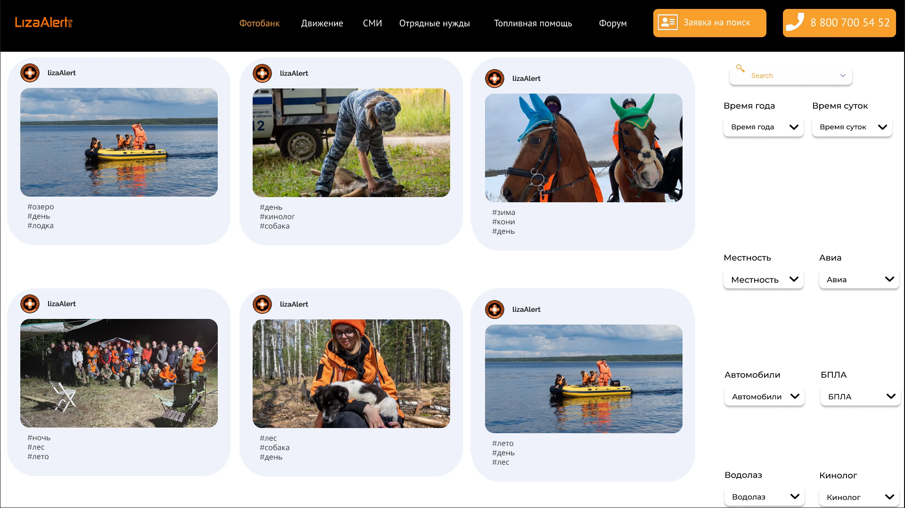

<h1 align="center">ИИ фотобанк для поискового отряда Лиза Аллерт</h1>
<h2 align="center">

[](https://github.com/vuejs/awesome-vue)

</h2>

<p align="center">


<!--  -->


<!--  -->


<!-- 

 -->
</p>



<h2 align="center"><a  href="https://disk.yandex.ru/i/TiKH14dJ2n3uMw">Демонстрация работы</a></h2>

<!-- ### [Contributions are Welcome](https://github.com/silent-lad/VueSolitaire/blob/master/CONTRIBUTING.md) -->

## Описание

Мы представляем систему классификации фото и видео материалов, каждый из которых содержит определенный список тэгов, созданных с использованием технологий искусственного интеллекта.

На основе собранных с места проведения работ фотографий на сайте появляется раздел “Фотобанк”, в котором можно будет найти вышеназванный материал, а также провести поиск по тэгам с целью просмотра конкретных изображений.

## Project setup

```
npm install
npm run serve
```

## Future scope

- Add winning animation.

## Support on Beerpay

Hey dude! Help me out for a couple of :beers:!

[](https://beerpay.io/silent-lad/VueSolitaire) [](https://beerpay.io/silent-lad/VueSolitaire?focus=wish)
